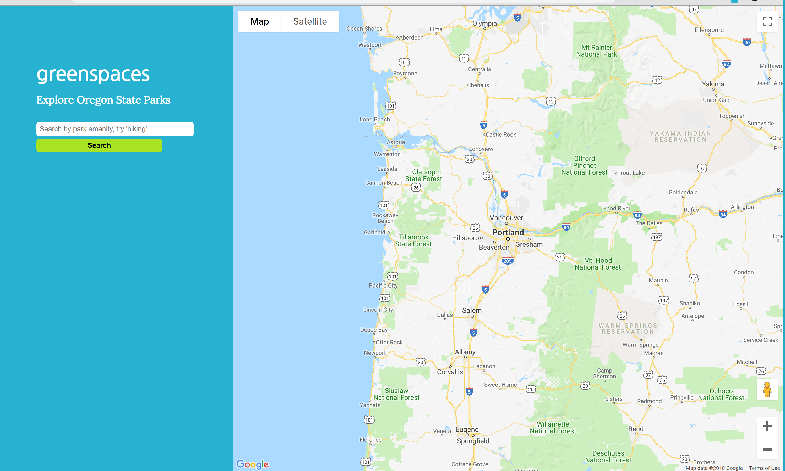

# greenspaces
Summary: Greenspaces webapp allows you to search for Oregon State Park by park amenity and view your results via google maps. 

Technology used: HTML/CSS/JavaScript/jQuery

Link to live app: https://nathogato.github.io/greenspaces/ 

Screenshot:

